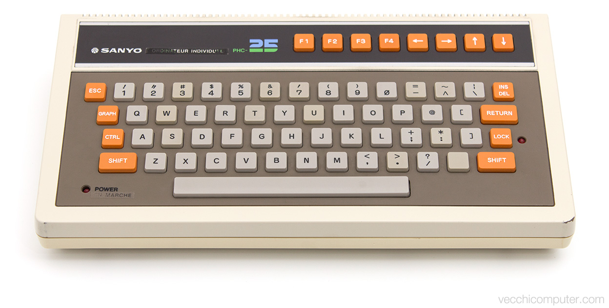
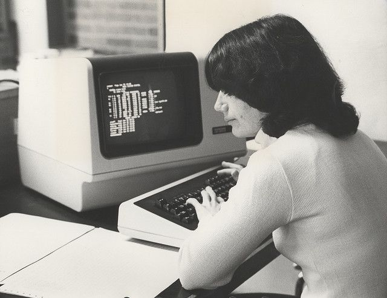

# Portfolio Site Project
Lessons from building a prototype protfolio page

## Design Landmarks




#### W3C Color Name: Beige
```css
background-color: beige;
```

## Concepts Used
### Drawing with CSS...
- border-radius <https://developer.mozilla.org/en-US/docs/Web/CSS/border-radius>
- box-shadow <https://developer.mozilla.org/en-US/docs/Web/CSS/box-shadow>
- linear-gradient <https://developer.mozilla.org/en-US/docs/Web/CSS/linear-gradient>
- radial-gradient <https://developer.mozilla.org/en-US/docs/Web/CSS/radial-gradient>
- overflow <https://developer.mozilla.org/en-US/docs/Web/CSS/overflow>
- position: relative and absolute <https://developer.mozilla.org/en-US/docs/Web/CSS/position>
- Inset Text Shadows <https://mayvendev.com/blog/inner-shadows-in-css-images-text-and-beyond>
- CSS Variables <https://developer.mozilla.org/en-US/docs/Web/CSS/Using_CSS_custom_properties>

### JS
- Event Delegation <https://learn.jquery.com/events/event-delegation/>
- setInterval <https://developer.mozilla.org/en-US/docs/Web/API/WindowOrWorkerGlobalScope/setInterval>
- setTimeout <https://developer.mozilla.org/en-US/docs/Web/API/WindowOrWorkerGlobalScope/setTimeout>
- Dom Transversing <https://www.w3schools.com/jquery/jquery_ref_traversing.asp>
- transform: scale(.90) <https://developer.mozilla.org/en-US/docs/Web/CSS/transform-function/scale>
- Switch statement <https://developer.mozilla.org/en-US/docs/Web/JavaScript/Reference/Statements/switch>
- @keyframes <https://developer.mozilla.org/en-US/docs/Web/CSS/@keyframes>
- Screen Effects <http://aleclownes.com/2017/02/01/crt-display.html>

### Terminal

```bash
➜ convert p1.jpg -resize 15% p1.png
➜ convert -scale 33.4% -scale 300% p1.png p1.png
➜ convert  p1.png -colorspace Gray p1.png
```



## Good Moments
- Learned a lot about gradients and box-shadows
- LEDs
- Fixed size screen that is responsive

## Issues
- Inner edge on the screen bezel
  - Tried 4 different ways, all had issues. Went with the one with the least issues
- Flickering inconsistent (projects vs. quotes)
- Hamburger menu stays hidden
- Responsiveness is iffy at small screens

## To Do
- Blinking Cursor Effect
- CPU demands: make a different text-glitch and scan line
- Learn about :before and :after for styling
- Add shadows or gradients to the inside bezel to add depth/light bleed effect
- fix caro big: clicking fast breaks it
- Quotes don't flicker in
- Nav buttons fill in the header text with "loading..." then title
- Make keys map to press of there lower side characters (change, not fn's)
- Style footer icons as keyboard logos
- Text distort effect super cpu intense
- Reposition profile photo
- Make it so when on project button, clicking it again doesn't toggle slide
- Hamburger button bug: if you toggle it down and then re-expand, it stays hidden 
- Make whole keyboard slide up, not buttons, for hamburger menu